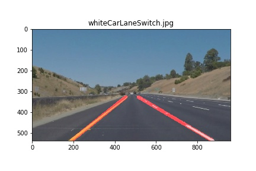
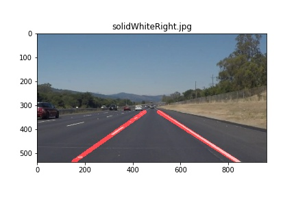

# Basic Lane Finding Project 

**Motivation**

Vision system of an autonomous vehicle is quite important as it guides the vehicle through a given path. So dedicated lane detection algorithm becomes the necessary requisite for the cars to move within highways and urban areas. So this project is about a basic lane detection uproach used to find lanes in a given images/video. As a part of this project, the lanes in the video is detected and lines are drawn on the video highlighting the lane in an image/frame.

**Implementation**

For detection of lanes in a image, we have to understand what information does the images contain. A image is a array of pixel which has 3 channels (R,G,B). The three channel constitutes for the color in an image. A Grey image or BW image will not have color instead a single channel with values from 0 (black) to 1 (white). Now detection of any shapes or specific objects are easier in grey images as we dont have to worry about R,G,B for processing. Also there are efficient edge detection / Corner detection algorithm that can be implemented on grey images. 

So my pipeline for lane detection will be as follows.

1. Input of the algorithm should be always an image. A video is nothing but a collection of images or frames, that could be seperated out as induvidual images.
2. Convert this RGB image to Gray image so that edge detection techniques can be implemented effectively.
3. With a grey image, a blur effect is applied to it just to make edges clear on a grey image. Most commonly used is Gaussian filter.
4. Blurred image are then used to detect edges through the common method called canny edge detection.
5. We dont require all the edges in the image and so we are interested only about the road, So we set parameters only to get the region of interest.
6. Edges detected are then converted to Hough space so that we can extract line information.
7. From these lines, we find the most dominant line which will approximate to the required lane shape.
8. The most dominant line found is marked in a different color on the input video to visualize the result.

**Algorithm**

As this project is a basic lane finding project, I have used just openCV for detection of the lanes (Advanced lane finding algorithm using deep learning will be the next project). Drawing line function is the method that finds the dominant line in a given image. All the students will differ in implementing this method. I can define my algorithm in three cases.

**Case I - Clear Edge Detection**

From the output of Hough Transform, I get list of lines combining both left lanes and right lanes. Each line will have two points - the starting point and end point of the line. Initially I seperate the lines whether they belong to left lane or right lane. This is found by using its location value and slope of the line.

After determining the lane side, all the points belonging to each side is collected. Then with this set of points, irrespective of whether they are starting or ending point, the best possible line is fitted. Similarly it is done for the other side. Now by this we get the slope and intercept of the dominant line in left and right side. 

To determine the length or range of the dominant line, confident possible range value in either side is calculated and compared. The maximum value is assigned for both the sides.

**Case I - Result**

**Case II - Edges Missing**

There is a unfortunate event when Canny edge detection could not find any edges in left or right edges. To handle these condition, I keep a track on the information of the previously found confident line. So whenever a unfortunate situation arises, it uses previous confident value. So till the edge is detected, it maintains the line values in the previously found confident line. As soon as the edge is detected, algorithm switches to the new line values.

**Case II - Result**

**Case III - Anomaly Case**

Since all the point are considered for finding the best fitting line, if there is a disturbance (shadows or patches misleading to false edge) present in the image, best fitting line affected a lot. For example, in a situation by which right edge is missing but there is some misleading patch (like shadows or reflections in below image), then my algorithm would consider it as a potential edge and line value will be calculated. So detected line will differ vastly from the real lane. To handle this I have used the following strategy. Whenever there is a change in intercept (or slope), there is a minimum threshold within which it is considered as a normal change. Anything more than the allowable change is considered as an anomaly situation. To handle this anomaly situation, again I use the same waay of using the previous confident line explained above.

**Case III - Result**

**Possible Shortcomings**

1. Since the previous line information is really important, initial position or the start position is expected to be in ideal condition. It means that atleast one edge should be detected when the car is started. If both the edges are missing in start position, this algorithm would not be able to handle this.

2. All the points in the data collected is given equal weightage. So for a small change, the line values are affected much and keeps on changing constantly which feels unstable when visualized. 

**Possible Improvements**
1. For solving the shortcoming of intial value of edges which are missing, by performing camera calibration, initial guess of the lanes could be estimated.

2. For solving the second point in shortcomings discussed above, it can be done through smoothing function. This could make the lines more stable.

**Result Analysis : My algorithm has performed well in the test images and videos. Also it is robost enough to handle even the challenge video of detecting lanes in curved road.**

Code File - P1.ipynb

Result files - Test images folder

Result videos - Test videos output folder
